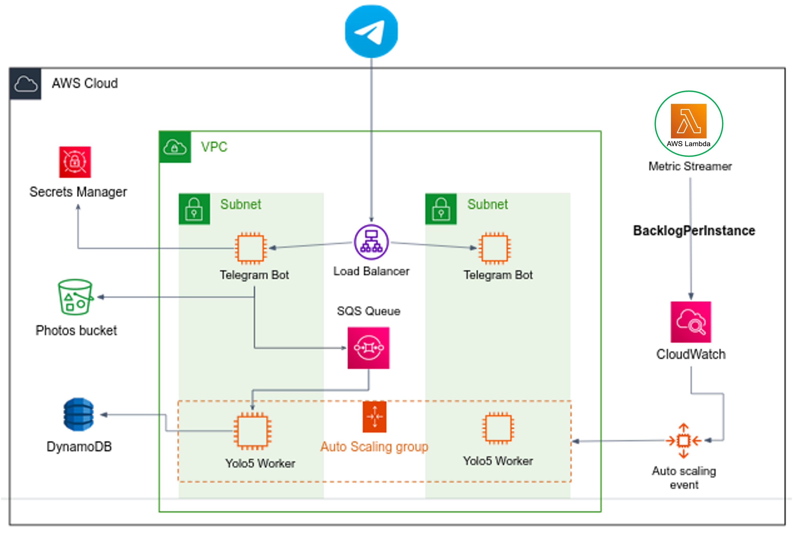

# LanaBot: An AI-Powered Telegram Bot for Fully Functional Text Chat, Object Detection and Image Generation

## Overview
LanaBot is an AI-driven Telegram bot that enhances user interaction through AI-powered text responses and advanced image analysis. Using OpenAI's GPT models for text interactions and YOLOv5 for object detection in images, the bot further utilizes DALL-E for creative image generation based on these detections. Hosted on AWS, LanaBot offers high scalability, security, reliability, and robust performance.

## Key Features
- **AI-Based Text Interactions**: Engage with users through smart conversations powered by OpenAI's GPT models.
- **Image Analysis and Object Detection**: Utilizes YOLOv5 for sophisticated object detection in user-uploaded images.
- **Creative Image Generation**: Generates images using DALL-E based on object detection results.
- **Scalable and Resilient Architecture**: Efficiently hosted on AWS with load balancing and auto-scaling, ensuring high availability.

## Architecture
**AWS Ecosystem Integration**: Incorporates ALB, Secrets Manager, ECR, EC2, S3, SQS FIFO, DynamoDB, Lambda and EventBridge, Cloud Watch and Auto Scaling Group for efficient scaling and handling varying loads.
  - **Core Components**:
    - **EC2 Instances**: Hosts the Telegram bot and YOLO object detection services.
    - **Docker Containers**: Provides consistent environments across services.
    - **AWS Load Balancer**: Manages and distributes incoming traffic.
    - **SQS FIFO**: Handles message queues between services.
    - **DynamoDB**: Stores YOLO prediction results.
    - **AWS Lambda & EventBridge**: Automates scaling and monitors system health.
  

## Prerequisites
- AWS account with configured access rights.
- Docker and Python installed on your local and EC2 machines.
- Telegram Bot API Key and OpenAI API Key.
